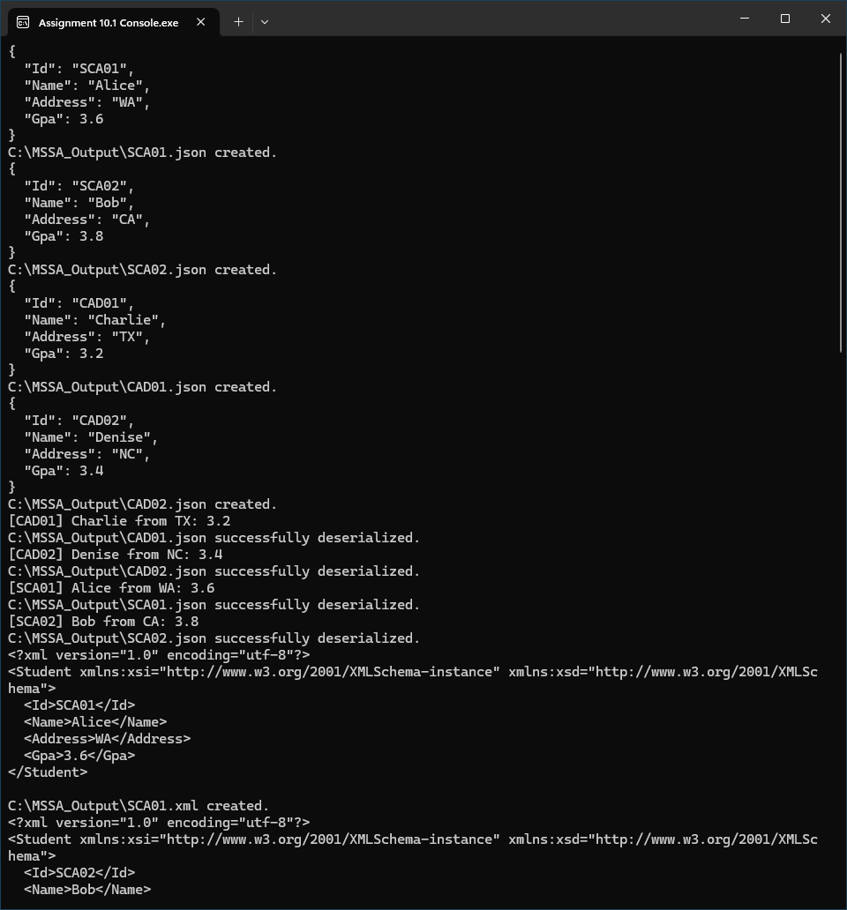
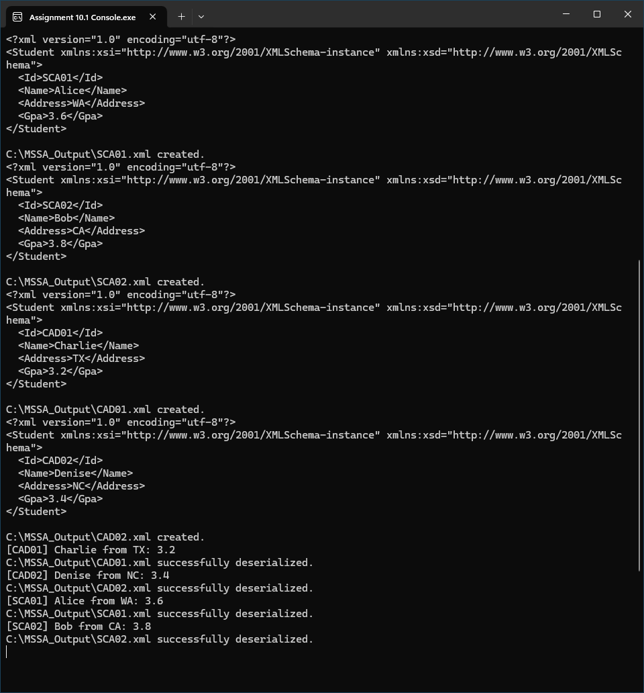

```cs
var studSer = new StudentSerializer(@"C:\MSSA_Output\");

studSer.AddStudent("SCA01", "Alice", "WA", 3.6);
studSer.AddStudent("SCA02", "Bob", "CA", 3.8);
studSer.AddStudent("CAD01", "Charlie", "TX", 3.2);
studSer.AddStudent("CAD02", "Denise", "NC", 3.4);

studSer.jsonSerializeMulti(0, 3);
studSer.jsonDeserializeAll();
studSer.xmlSerializeMulti(0, 3);
studSer.xmlDeserializeAll();

Console.ReadKey();
```


